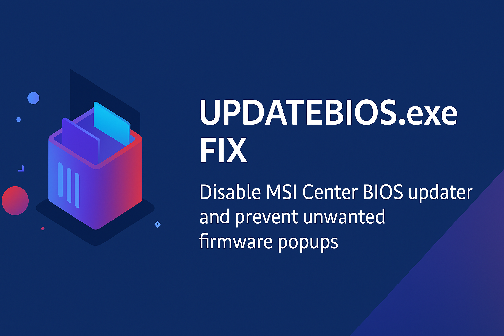

<p align="center">
  
</p>

# MSI Center BIOS Updater Permanent Fix
This repository contains a fully documented solution for fixing the recurring  
`UPDATEBIOS.exe` errors, MSI Center popups, ACPI conflicts, and related BSOD crashes.

---

## 📄 Download the Full PDF Guide
**[Download MSI_Center_Updater_Fix.pdf](./MSI_Center_Updater_Fix.pdf)**

---

## 🔧 Summary of the Fix

### ✔ Problem
MSI Center installs a hidden module called **MSI_Center_Updater**, which includes:
- `UPDATEBIOS.exe`
- Firmware update scripts
- Hotfix modules  
This updater frequently becomes corrupted and regenerates itself, causing:
- Errors on startup
- ACPI issues
- `ntoskrnl.exe` BSODs

---

## ✔ Permanent Solution

### Steps:
1. Stop MSI services  
2. Take ownership of the updater folder  
3. Delete the BIOS updater modules  
4. Recreate the folder empty  
5. Apply a DENY write permission to block regeneration  
6. Restart MSI Center services  

MSI Center keeps working normally (MUX switch, fan control, RGB),  
but firmware updates are permanently disabled and cannot break the system again.

---

## 🛠 Commands (Full list in the PDF)

```
Stop-Service "MSI Foundation Service" -Force
Stop-Service "MSI_Center_Service" -Force
Stop-Service "MSI Sendevsvc" -Force
```

```
takeown /f "C:\Program Files (x86)\MSI\MSI_Center_Updater" /r /d y
icacls "C:\Program Files (x86)\MSI\MSI_Center_Updater" /reset /t /c
icacls "C:\Program Files (x86)\MSI\MSI_Center_Updater" /grant "Administrators:(F)" /t
icacls "C:\Program Files (x86)\MSI\MSI_Center_Updater" /grant "SYSTEM:(F)" /t
```

```
Remove-Item "C:\Program Files (x86)\MSI\MSI_Center_Updater" -Recurse -Force
New-Item -Path "C:\Program Files (x86)\MSI\MSI_Center_Updater" -ItemType Directory
```

```
icacls "C:\Program Files (x86)\MSI\MSI_Center_Updater" /inheritance:r
icacls "C:\Program Files (x86)\MSI\MSI_Center_Updater" /grant:r "SYSTEM:(RX)"
icacls "C:\Program Files (x86)\MSI\MSI_Center_Updater" /grant:r "Administrators:(RX)"
icacls "C:\Program Files (x86)\MSI\MSI_Center_Updater" /deny "*S-1-1-0:(W)"
```

---

## 🧩 Result
- UPDATEBIOS.exe cannot regenerate  
- No more popups  
- No more crashes  
- MSI Center remains fully functional  
- Permanent protection against MSI firmware updater bugs  

---

Pull requests welcome if others want to extend or improve the documentation.
